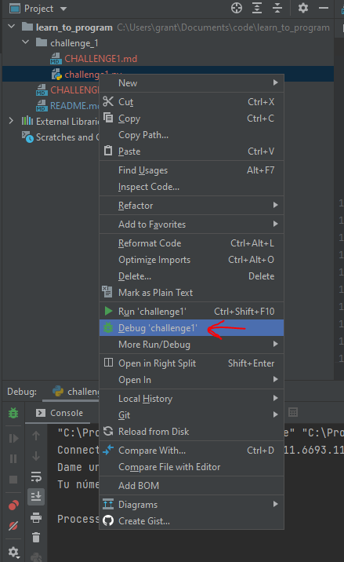

# Challange 1 - Get an IDE working

## Intro

For your first challenge you need to begin to learn the tools of the trade. In this case the integrated development environment (IDE). Almost all programming languages use an IDE for development. While you could actually do everything in notepad.exe, that's pretty painful. An IDE will point out your mistakes, speed up debugging, and generally make your life easier.

Furthermore, you need to start developing the ability to do a few things:

- Face difficult technical problems and break those problems down into smaller pieces
- Figure out how to start projects where you have absolutely no idea what you're doing (this is common in actual industry - do not expect someone to hold your hand and send you to a bunch of training)
- Improve your ability to Google problems and find answers
- Begin to develop your academic determination. You will frequently encounter problems that can be difficult to solve and results are not immediate. You have to learn how to be satisfied with taking intermitent steps towards a larger goal that may take you a protracted period of time to complete
- Learn how to face what will initially feel like an overwhelming amount of information and take it on strategically

## Goal

Using the IDE called PyCharm Community Edition (you don't need the pro edition [it has features mostly for working in larger teams]), write a Python program which accepts a number as input. If the number is less than 100, the program should print, "I'm less than 100!" otherwise it should print, "I'm more than 100".

You can download PyCharm Community edition [here](https://www.jetbrains.com/pycharm/).

Here is a YouTube video of the program working: https://youtu.be/miaIvUvidl4

You can't see the menu in the video but this is how to launch the debugger:

### Pro Tip

Google everything. I've been doing this since I was 11 and even as a professional software engineer my first step when I have a problem is still to Google it.

Things you might Google:

- python 3 conditional statements
- python 3 how to receive user input (you could do this multiple ways)
- python 3 how to output
- pycharm how to use debugger

### **WARNING**

Make sure to use Python 3! Not Python 2! When you Google Python, you may get results for Python 2. Python 2 is different from Python 3. I would suggest when you Google things, if you use the word Python, you actually Google "python 3" specifically to avoid getting outdated results. This caught me up a lot when I was first learning many years ago.

## Long Term Goal

Python has gaming libraries but all of them require you to have a strong foundation in basic programming skills before you can do anything with them. The point of these exercises is to determine if you have the drive and aptitude for programming and teach you the skills you'll need to take on tougher challenges.

## Resources

I've decided to leave this up to you for now. A huge part of being good with computers is figuring out how to learn effectively and quickly. That might be a book for you, maybe it's just reading blogs, maybe it's a website. Different people work differently. Personally, I tend to read websites and Google blog posts for more specific problems.

If you want a For Dummies book, you could try [this one](https://archive.org/details/python-all-in-one-for-dummies/Python%20All-In-One%20for%20Dummies)

For memorizing things I strongly recommend [Anki](https://apps.ankiweb.net/#download)