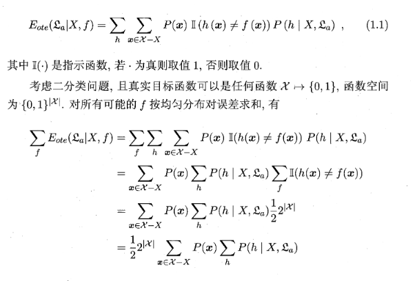
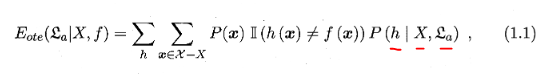
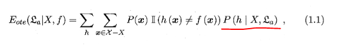

# Challenge 2

Given how easy that first one was for you, I'm giving you something significantly more difficult. In fact, it's a common programming challenge you see in high school or intro to programming classes in college. The goal is two fold:

1. Learn the building blocks of controlling the flow of a computer program using conditional statements and loops
2. Start the process of teaching your mind how to translate how you think as a human to machine language (programming)

The challenge is deceptively simple, write a program that prints the following:

    * 
    * * 
    * * * 
    * * * * 
    * * * * * 

To complete the challenge you will have to use a nested for loop. I thought it might be too easy if I gave you something only requiring you to use one. A good starting place is Python's [official documentation on the subject](https://wiki.python.org/moin/ForLoop).

Once you have figured out the key to the first pattern apply what you know to print the following other patterns each harder than the last:

            * 
          * * 
        * * * 
      * * * * 
    * * * * * 

        * 
       * * 
      * * * 
     * * * * 
    * * * * * 

The first time you do this I expect it to take you quite a bit. The hardest part is teaching your brain how to think like a computer and translate concepts and patterns that to us as humans are inherently obvious but to a computer, not so much. While the problem appears simple, don't be discouraged if you spend a long time thinking about it. That's normal - even if you have a natural talent for the subject.

## Strategy

This challeng is significant because it has multiple parts you don't yet understand. If you get stuck when facing a challenge with multiple layers of things you don't know about, break it down into sub-problems. For example, printing:

    * 
    * * 
    * * * 
    * * * * 
    * * * * * 

is comparatively difficult. Instead of trying to tackle the entire problem all at once, try just printing:

    *
    * 
    * 
    * 
    * 

Take it on piece by piece until you understand the entire thing. Even I do this in my job. For example, I had to figure this out:

I had absolutely no idea what it meant. None whatsoever. Might as well have been nonsense language. So I started by just asking ok... what do these three variables mean:

After that I figured out what this meant:

Then I kept doing that for everything else you see on that original page until it all made sense. I don't know how many hours I spent in total having to go back and review previosu parts of the book... but it was a lot. Plus a friend helped me.

Like you said, determination is everything.